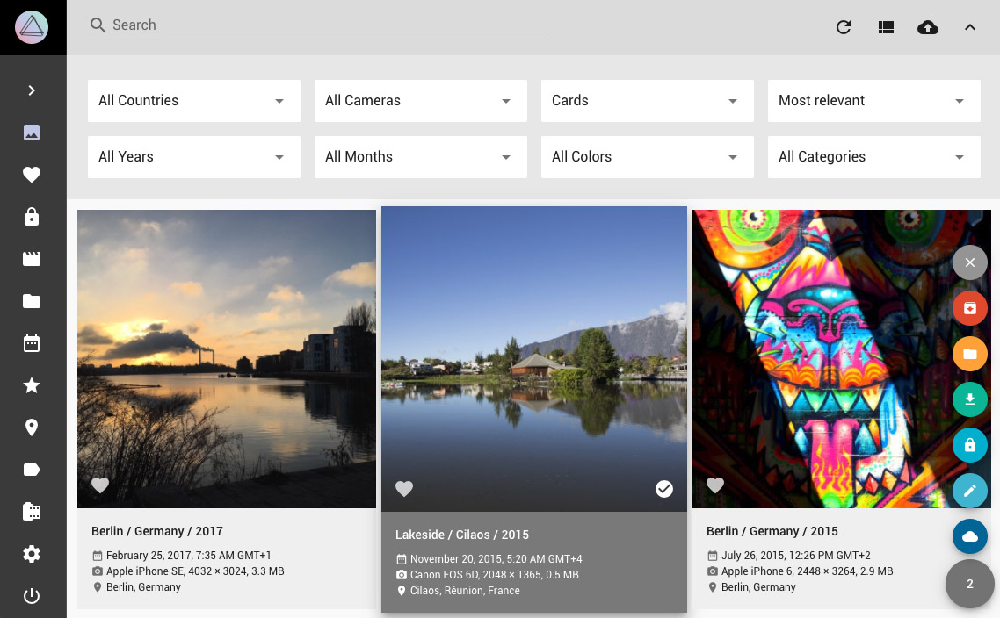

hero: Your own private google photos

# Photoprism

[Photoprism™](https://github.com/photoprism/photoprism) "is a server-based application for browsing, organizing and sharing your personal photo collection. It makes use of the latest technologies to automatically tag and find pictures without getting in your way. Say goodbye to solutions that force you to upload your visual memories to the cloud."




## Ingredients

1. [Docker swarm cluster](/ha-docker-swarm/design/) with [persistent shared storage](/ha-docker-swarm/shared-storage-ceph.md)
2. [Traefik](/ha-docker-swarm/traefik_public) configured per design
3. DNS entry for the hostname you intend to use, pointed to your [keepalived](ha-docker-swarm/keepalived/) IP

## Preparation

### Setup data locations

First we need a folder to map the photoprism config file:
```
mkdir /var/data/photoprism/config
```

We will need a location to store photoprism thumbnails, as they can be recreated anytime (althought depending on your collection size it could take a while), we store them on a "non-backed-up" folder

```
mkdir /var/data/runtime/photoprism/cache
```

We will need to map three folders on our system / data:

1. originals - the folder where our original photo collection is stored (photoprism doesn't modify any original file, it only adds sidecars files).
2. import - the folder where photoprism will pick new photos to be added to the collection
3. export - the folder where photoprism will export photos.
  
In order to be able to import/export files from / to  the originals folder make sure that the running user of the photoprims instance has write / read access to those folders.

Photoprism has with its own running db, but if your collection is big (10K photos or more), the perfomance is best using an external db instance. We will use MariaDb, so we need the folders for running and backing the db:

```
mkdir /var/data/runtime/photoprism/db
mkdir /var/data/photoprism/database-dump
```

### Prepare environment

Create ```photoprism.env```, and populate with the following variables. Change passwords

```
PHOTOPRISM_URL=https://photoprism.example.com
PHOTOPRISM_TITLE=PhotoPrism
PHOTOPRISM_SUBTITLE=Browse your life
PHOTOPRISM_DESCRIPTION=Personal Photo Management powered by Go and Google TensorFlow. Free and open-source.
PHOTOPRISM_AUTHOR=Anonymous
PHOTOPRISM_TWITTER=@rowseyourlife
PHOTOPRISM_UPLOAD_NSFW=true
PHOTOPRISM_HIDE_NSFW=false
PHOTOPRISM_EXPERIMENTAL=false
PHOTOPRISM_DEBUG=false
PHOTOPRISM_READONLY=false
PHOTOPRISM_PUBLIC=false
PHOTOPRISM_ADMIN_PASSWORD=photoprism #change
PHOTOPRISM_WEBDAV_PASSWORD=photoprism #change
PHOTOPRISM_TIDB_HOST=0.0.0.0
PHOTOPRISM_TIDB_PORT=2343
PHOTOPRISM_TIDB_PASSWORD=photoprism
PHOTOPRISM_DATABASE_DRIVER=mysql
PHOTOPRISM_DATABASE_DSN=photoprism:photoprism@tcp(db:3306)/photoprism?parseTime=true
PHOTOPRISM_SIDECAR_HIDDEN=true
PHOTOPRISM_THUMB_FILTER=lanczos
PHOTOPRISM_THUMB_UNCACHED=false
PHOTOPRISM_THUMB_SIZE=2048
MYSQL_ROOT_PASSWORD=<set to something secure>
MYSQL_USER=photoprism
MYSQL_PASSWORD=photoprism
MYSQL_DATABASE=photoprism
```

Now create a **separate** photoprism-db-backup.env file, to capture the environment variables necessary to perform the backup. (_If the same variables are shared with the mariadb container, they [cause issues](https://discourse.geek-kitchen.funkypenguin.co.nz/t/nextcloud-funky-penguins-geek-cookbook/254/3?u=funkypenguin) with database access_)

````
# For database backup (keep 7 days daily backups)
MYSQL_PWD=<set to something secure, same as MYSQL_ROOT_PASSWORD above>
MYSQL_USER=root
BACKUP_NUM_KEEP=7
BACKUP_FREQUENCY=1d
````

### Setup Docker Swarm

Create a docker swarm config file in docker-compose syntax (v3), something like this:

!!! tip
        I share (_with my [sponsors](https://github.com/sponsors/funkypenguin)_) a private "_premix_" git repository, which includes necessary docker-compose and env files for all published recipes. This means that sponsors can launch any recipe with just a ```git pull``` and a ```docker stack deploy``` 👍


```
version: '3.3'

services:
  app:
    image: photoprism/photoprism:latest
    env_file: /var/data/config/photoprism/photoprism.env
    networks:
      - internal
      - traefik_public
    volumes:
     - /etc/localtime:/etc/localtime:ro
     - /path/to/originals:/photoprism/originals
     - /path/to/import:/photoprism/import
     - /path/to/export:/photoprism/export
     - /var/data/runtime/photoprism/cache:/photoprism/cache
     - /var/data/photoprism/config:/photoprism/config

    deploy:
      labels:
        - traefik.frontend.rule=Host:photoprism.funkypenguin.co.nz
        - traefik.docker.network=traefik_public
        - traefik.port=2342
  db:
    image: mariadb:10.5
    env_file: /var/data/config/photoprism/photoprism.env
    command: |
      --character-set-server=utf8mb4
      --collation-server=utf8mb4_unicode_ci
      --max-connections=1024
    networks:
      - internal
    volumes:
      - /etc/localtime:/etc/localtime:ro
      - /var/data/runtime/photoprism/db:/var/lib/mysql

  db-backup:
    image: mariadb:10.5
    env_file: /var/data/config/photoprism/photoprism-db-backup.env
    volumes:
      - /var/data/photoprism/database-dump:/dump
      - /var/data/runtime/photoprism/db:/var/lib/mysql
      - /etc/localtime:/etc/localtime:ro
    entrypoint: |
      bash -c 'bash -s <<EOF
      trap "break;exit" SIGHUP SIGINT SIGTERM
      sleep 2m
      while /bin/true; do
        mysqldump -h db --all-databases | gzip -c > /dump/dump_\`date +%d-%m-%Y"_"%H_%M_%S\`.sql.gz
        (ls -t /dump/dump*.sql.gz|head -n $$BACKUP_NUM_KEEP;ls /dump/dump*.sql.gz)|sort|uniq -u|xargs rm -- {}
        sleep $$BACKUP_FREQUENCY
      done
      EOF'
    networks:
      - internal

networks:
  traefik_public:
    external: true
  internal:
    driver: overlay
    ipam:
      config:
        - subnet: 172.16.90.0/24
```

!!! note
    Setup unique static subnets for every stack you deploy. This avoids IP/gateway conflicts which can otherwise occur when you're creating/removing stacks a lot. See [my list](/reference/networks/) here.


## Serving

### Launch Photoprism stack

Launch the Photoprism stack by running ```docker stack deploy photoprism -c <path -to-docker-compose.yml>```

Browse to your new browser-cli-terminal at https://**YOUR-FQDN**, with user "admin" and the password you specified in photoprism.env

## Chef's Notes 📓

1. Once it is running, you probably will want to launch an scan to index the originals photos. Go to *library -> index* and do a complete rescan (it will take a while, depending on your collection size)